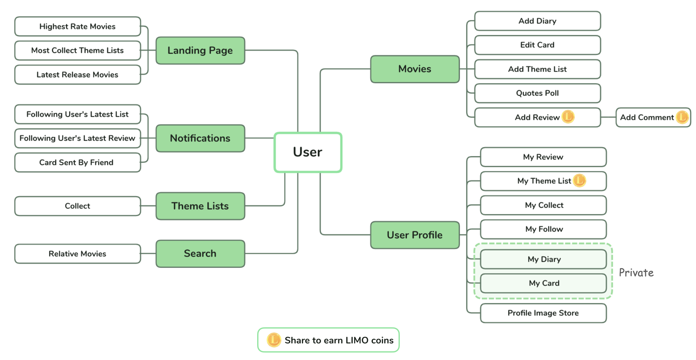

# Limo

 

A unique movie review platform, encouraging users to share movie reviews, theme lists and film still cards with customized messages!

## 🎦 Introduction

Website Link : [LIMO >>](https://limo-movie.web.app/)

- Rate and share movie reviews for what you watch!
- Create your own movie theme list to collect your favorite movies!
- Build your private movie diary page to add own hashtag and keep personal notes! 
- Send greeting message to friends on chosen film still!
- Change profile image to your favorite Marvel hero by earned LIMO coins!

You can register a new account or use default test account as below:
- Account: test@limo.com
- Password: test123

## ⏪ Techniques

- Front-End Fundamental
  - HTML / CSS / JavaScript
  - Responsive Web Design (RWD)
- Frameworks & Library
  - React (Hooks)
  - React Router
  - Redux
- Python
  - requests-HTML
  - Crawled movie data from [電影神搜](https://news.agentm.tw/)
- Firebase
  - Authentication
  - Functions
  - Firestore
  - Hosting
- Packages
  - algoliasearch
  - fabric
  - moment
  - react-polls
  - react-parallax
  - react-slick
  - react-sparkle
  - react-waypoint
  - styled-components
- Other
  - Lint Tool: ESLint / Prettier
  - Unit Test: Jest

## ⏸ Flow Chart

## ▶️ Features

- #### Landing page and add review
  
- #### Send film still card
  
- #### Instant notification 
  
- #### Change profile image
  

## ⏩ Future Features

- Build cloud function to crawl latest movie data weekly.
- Create search API to scrawl data instantly based on users' search keyword.
- Add movie quizes for users to challenge and earn coins.
- Upload more profile images for users to choose.

## ⏯ Contact 

- Author: Dora Hsieh
- E-mail: <fly9687@gmail.com>

